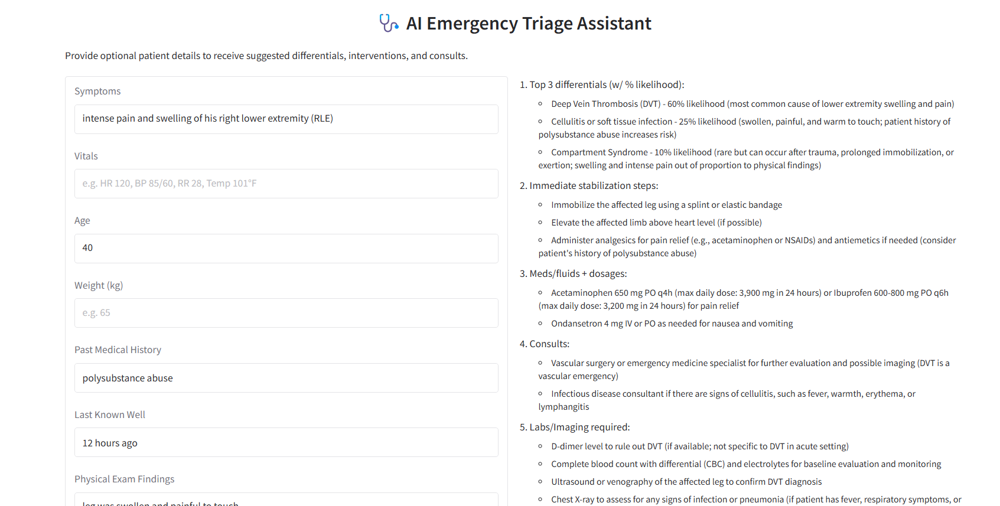

# 🩺 AI Emergency Triage Assistant

A clinical decision-support tool for emergency medicine that suggests differentials, interventions, and consults based on patient input — enhanced with real-time PubMed search and embedded evidence from landmark studies.

## Features
- Gradio-based interface
- Accepts symptoms, vitals, PMH, physical exam findings, and more
- Real-time PubMed abstract retrieval
- Embeds abstracts using HuggingFace + FAISS
- Generates evidence-based triage plans using GPT or Mistral

## How it works
1. Takes optional clinical inputs from a user
2. Constructs a PubMed search query
3. Retrieves and embeds abstracts on-the-fly
4. Sends all relevant info and context to a local or cloud LLM
5. Returns a structured response: differentials, treatments, and justifications

## Installation
```bash
git clone https://github.com/mjkovoor/TriageApp.git
cd triage-assistant
pip install -r requirements.txt
```

## Setup
Create a `.env` file in the root directory with your OpenAI key:
```bash
OPENAI_API_KEY=sk-your-openai-key
```

## Run the App
```bash
python triage_assistant.py
```

## Demo


## 📝 License
MIT License

Copyright (c) 2025 Matthew Kovoor

Permission is hereby granted, free of charge, to any person obtaining a copy
of this software and associated documentation files (the "Software"), to deal
in the Software without restriction, including without limitation the rights
to use, copy, modify, merge, publish, distribute, sublicense, and/or sell
copies of the Software, and to permit persons to whom the Software is
furnished to do so, subject to the following conditions:

The above copyright notice and this permission notice shall be included in all
copies or substantial portions of the Software.

THE SOFTWARE IS PROVIDED "AS IS", WITHOUT WARRANTY OF ANY KIND, EXPRESS OR
IMPLIED, INCLUDING BUT NOT LIMITED TO THE WARRANTIES OF MERCHANTABILITY,
FITNESS FOR A PARTICULAR PURPOSE AND NONINFRINGEMENT. IN NO EVENT SHALL THE
AUTHORS OR COPYRIGHT HOLDERS BE LIABLE FOR ANY CLAIM, DAMAGES OR OTHER
LIABILITY, WHETHER IN AN ACTION OF CONTRACT, TORT OR OTHERWISE, ARISING FROM,
OUT OF OR IN CONNECTION WITH THE SOFTWARE OR THE USE OR OTHER DEALINGS IN THE
SOFTWARE.

